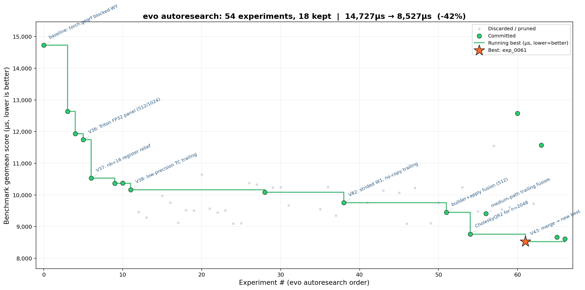

# GPU MODE QR Kernel Competition

Batched square compact-Householder QR factorization on an NVIDIA B200, submitted to
the [GPU MODE `qr_v2` leaderboard](https://www.gpumode.com/leaderboard/773?tab=rankings)
via [Popcorn CLI](https://gpumode.com). Deadline: June 30, 2026.

The kernel is scored on the geometric-mean runtime across 12 benchmark shapes
(dense/rank-deficient/near-collinear/band/etc.), gated by two correctness checks
(factor residual, orthogonality). See [`AGENTS.md`](AGENTS.md) and
[`experiment_plan.md`](experiment_plan.md) for the full technical log.

## Progress: hand-tuning → evo autoresearch

We worked this in two stages:

1. **Hand-written kernels (V0 → V31).** Started from `torch.geqrf`, moved to a
   blocked Householder (WY) scheme, then a custom CUDA panel + cuBLAS trailing
   GEMM, then extended the blocked path to `n=1024`. This took the dominant
   `(640,512)` shape from **1074 ms → 62 ms** and became the seed for automated
   search.
2. **evo autoresearch.** From that V31 baseline, we pointed
   [evo](https://github.com/karpathy/autoresearch)-style automated experimentation
   at the kernel: it proposes a change, runs it through the correctness gate and
   benchmark, and keeps it only if it's a genuine improvement. Over ~68
   experiments it cut the benchmark score another **42%**:

*Green dots = kept (new best at that point in time), grey = tried and discarded,
orange star = best result found. Generated straight from the evo run's own
experiment graph (`.evo/run_0000`), not a mockup.*

## Notes on how we made progress

- **Automated search beat hand-tuning on the *last* mile, not the first.**
  Getting from the `torch.geqrf` baseline to a competitive hand-written kernel
  (V0→V31) took human intuition and profiling. Squeezing the next 42% out of an
  already-optimized kernel — vectorizing the panel, register-tiling, exploiting
  precision headroom — is exactly the kind of high-throughput trial-and-error
  where letting an agent run dozens of small, gated experiments in parallel
  paid off more than further hand-tuning would have.
- **The real bottleneck was the panel, not the GEMM.** Profiling (ours and the
  competition Discord's) agreed the sequential Householder panel factorization
  dominates runtime, not the trailing matrix-matrix update. The single biggest
  win (`V36`, −48% on the critical `(640,512)` shape) came from replacing a
  serial double-precision panel with a vectorized Triton FP32 panel — a GEMM
  optimization would not have found this.
- **Read the correctness gates like a spec, not a suggestion.** The checker's
  tolerances are loose enough that low-precision tensor-core math is legal on
  parts of the computation. `V38` found this by measuring the actual safety
  margin (4–10× on the factor residual) and selectively dropping precision only
  where it was free — a ~9% win that pure algorithmic changes couldn't match.
- **The platform's rules shaped the algorithm.** Popcorn silently disqualifies
  any submission that touches a non-default CUDA stream — which rules out
  cooperative-kernel launches, thread-block clusters, and even batched
  `torch.linalg` calls that fan out internally. Several promising ideas
  (grid-sync panels, CholeskyQR2 via batched cuSOLVER) worked great on paper
  and failed silently on the real target; we only found out by testing on
  Popcorn early, not by trusting local benchmarks alone.
- **Audit the experiment tree, don't just trust the "current best" pointer.**
  A metric-versioning change accidentally re-baselined the search from an
  older checkpoint, silently hiding the actual best result
  (`exp_0061`/**V43**) for over a week. It only surfaced when we manually
  diffed scores across every branch in `.evo/run_0000/`. Lesson: whenever the
  scoring method changes, re-derive "best" from raw recorded scores, not from
  whatever the tool currently has checked out.

## Result

**Best verified kernel: V43** (`solutions/v43_cholqr2048_medium_fusion_merge/`,
also the root `submission.py`) — ≈**10,901 µs** geometric mean across the real
12-shape ranked benchmark, 26/26 correctness cases pass on Modal. That's a
**~27% reduction** from the V31 hand-tuned baseline it was built on top of, and
a ~42% reduction on evo's own internal scoring metric across the autoresearch
phase alone.

For the shape-by-shape numbers and the full experiment history (43+ hand-written
versions, 68 evo experiments), see [`experiment_plan.md`](experiment_plan.md).
