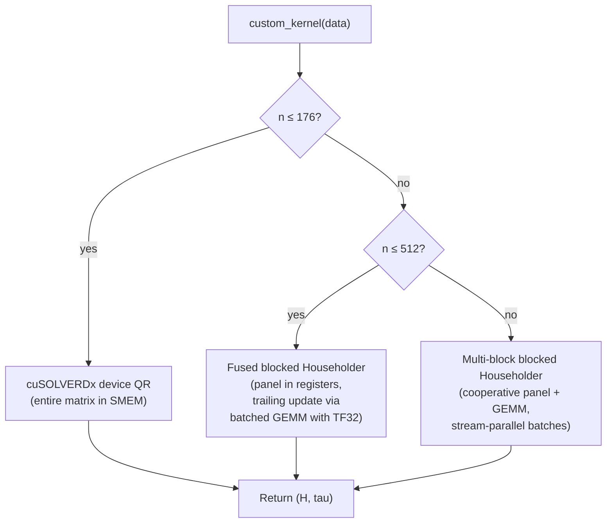
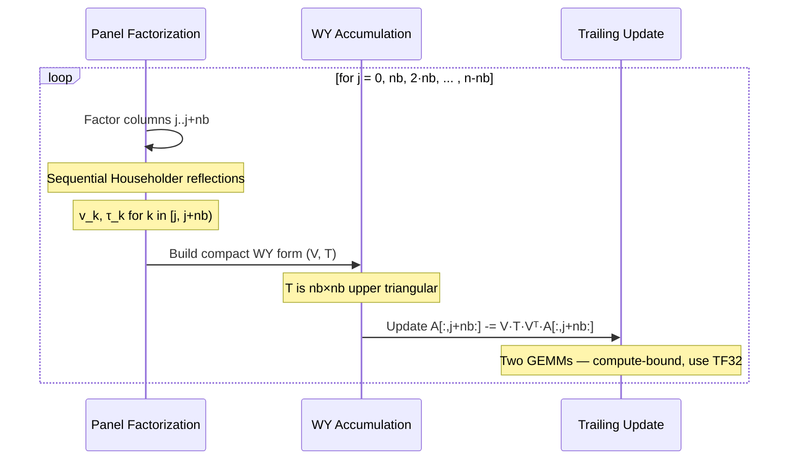

# feat: GPU MODE QR Decomposition Kernel Competition

## Summary

Plan for competing in the GPU MODE Linear Algebra QR Kernel Competition on B200. Covers bootstrapping the project, then a phased progression from baseline `torch.geqrf` through cuSOLVER batched dispatch, custom blocked Householder QR with CUDA inline kernels, and mixed-precision trailing updates — targeting a top-3 finish by the June 30 deadline.

---

## Problem Frame

The GPU MODE competition requires implementing batched square compact-Householder QR factorization that runs faster than the reference `torch.geqrf` on NVIDIA B200 GPUs. The current #1 submission achieves 704μs geometric mean — 63x faster than baseline. The workspace has zero existing CUDA kernel code, so the plan must cover both learning infrastructure and algorithmic progression within a 15-day window.

The QR problem is motivated by second-order optimizers (Shampoo/SOAP) where batched QR of gradient statistics matrices is the cubic-complexity bottleneck. The critical benchmark shape is `batch=640, n=512` — optimizer-style square matrices.

---

## Requirements

**Submission mechanics**

- R1. Submission is a single `submission.py` file containing `custom_kernel(data: input_t) -> output_t` that returns `(H, tau)` in compact Householder format matching `torch.geqrf` convention
- R2. Must pass all 19 correctness tests: factor residual `rtol = 20·n·eps32`, orthogonality `rtol = 100·n·eps32`, across dense, rank-deficient, near-rank-deficient, banded, row-scaled, near-collinear, upper-triangular, and clustered-scale inputs
- R3. Ranked by geometric mean runtime across 7 benchmark shapes: `(20,32)`, `(40,176)`, `(40,352)`, `(640,512)`, `(60,1024)`, `(8,2048)`, `(2,4096)` as `(batch, n)`

**Performance targets**

- R4. Beat baseline `torch.geqrf` by at least 10x on geometric mean (baseline ~45ms, target <4.5ms)
- R5. Achieve sub-2ms geometric mean to be competitive for top-5 (current #2 is 1.2ms, #3 is 1.67ms)

**Constraints**

- R6. Internal mixed-precision (FP16, TF32, FP8) is allowed but output `H` and `tau` must be FP32
- R7. Must handle the full spectrum of matrix conditioning without special-casing (evaluator randomizes seeds)

---

## Key Technical Decisions

- KTD-1. **CUDA inline via `load_inline` over Triton**: Triton cannot express the sequential panel dependencies in Householder QR, lacks fine-grained shared memory and register control, and has no access to B200's TMA or TMEM. Past competition winners consistently drop from Triton to CUDA for the final 2-3x.

- KTD-2. **Size-adaptive dispatch**: No single kernel strategy is optimal across `n=32` to `n=4096`. Use cuSOLVER/cuSOLVERDx for small matrices where the entire problem fits in shared memory, custom blocked Householder for medium sizes, and multi-block cooperative factorization for large sizes. Dispatch boundaries tuned empirically.

- KTD-3. **Blocked Householder with nb=32 for medium/large matrices**: Panel width nb=32 balances panel factorization cost against trailing update GEMM efficiency. For n=512 this means 16 panel steps where each panel (512×32 = 64KB) fits in B200's 228KB shared memory.

- KTD-4. **TF32 for trailing matrix updates**: The trailing update `A := A - V·T·Vᵀ·A` is GEMM-dominated. TF32 tensor cores give ~2x throughput over FP32 with 10-bit mantissa. The competition's tolerance (`20·n·eps32`) accommodates this accuracy trade-off.

- KTD-5. **Popcorn CLI as the sole submission/benchmarking tool**: No Modal GPU needed — Popcorn runs submissions remotely on B200. Local development uses any CUDA GPU for correctness testing only.

- KTD-6. **Experiment tracking adapted for kernel optimization**: Each kernel version is an experiment. Metrics are per-shape runtimes and geometric mean. The 3-tier pipeline becomes: local correctness → `popcorn test` → `popcorn leaderboard`.

---

## High-Level Technical Design

The competition requires optimizing across 7 benchmark shapes spanning 3 orders of magnitude in matrix size. A single kernel strategy cannot dominate all shapes, so the design uses size-adaptive dispatch.

### Blocked Householder QR algorithm

For a single `n×n` matrix with block size `nb`:

The panel factorization is memory-bound and inherently sequential (each reflection depends on the previous). The trailing update is compute-bound and parallelizable via batched GEMM. The optimization challenge is minimizing the panel bottleneck while maximizing trailing update throughput.

### Per-shape strategy

| Shape | batch | n | Strategy | Rationale |
|-------|-------|---|----------|-----------|
| Small | 20-40 | 32-176 | cuSOLVERDx device API | Matrix fits in SMEM (32²×4=4KB, 176²×4=121KB < 228KB) |
| Medium | 40-640 | 352-512 | Fused blocked Householder | Panel in registers, trailing via `cublasGemmStridedBatched` TF32. High batch saturates SMs |
| Large | 2-60 | 1024-4096 | Multi-block cooperative | Low batch — need multi-block per matrix. Panel via shared memory, trailing via cuBLAS |

---

## Scope Boundaries

### In scope

- Single `submission.py` file optimized for B200
- All 7 benchmark shapes with correctness across all 19 test cases
- Size-adaptive dispatch between strategies
- Mixed-precision internals (TF32 trailing updates)
- Iterative profiling and tuning via Popcorn CLI

### Deferred to Follow-Up Work

- CuTe DSL implementation (higher ceiling but steeper learning curve — pursue if blocked on CUDA inline performance)
- B200-specific hardware features (TMA multicast, TMEM, cluster-level parallelism) — pursue only if blocked on memory bandwidth
- CholeskyQR2 alternative algorithm (all-GEMM, but squares condition number — risky for stress tests)
- Future competition problems (SVD, eigendecomposition mentioned by organizers)

---

## Implementation Units

### U1. Bootstrap competition folder and tooling

**Goal:** Set up `qrproblem/` with project config, install Popcorn CLI, download reference files, verify end-to-end submission flow.

**Requirements:** R1

**Dependencies:** None

**Files:**
- `qrproblem/pyproject.toml` (create)
- `qrproblem/.gitignore` (create)
- `qrproblem/AGENTS.md` (create)
- `qrproblem/experiment_plan.md` (create)
- `qrproblem/submission.py` (create)
- `qrproblem/reference.py` (create)
- `qrproblem/task.py` (create)
- `qrproblem/eval.py` (create)

**Approach:** Initialize `uv` project with `torch` dependency. Install Popcorn CLI via official script. Download all reference files from `gpu-mode/reference-kernels`. Create `AGENTS.md` with competition-specific conventions and `experiment_plan.md` adapted for kernel optimization tracking.

**Patterns to follow:** Existing competition folder structure from pen-classification and nemotron, adapted for kernel optimization workflow.

**Test scenarios:**
- `popcorn submit --mode test submission.py` passes all 19 tests with baseline `torch.geqrf`
- Local `eval.py` runs with baseline submission
- `uv run python -c "import torch; print(torch.cuda.is_available())"` confirms CUDA

**Verification:** Baseline submission passes Popcorn test mode.

---

### U2. Baseline profiling and per-shape analysis

**Goal:** Submit baseline to leaderboard, record per-shape timings, identify which shapes dominate the geometric mean.

**Requirements:** R3, R4

**Dependencies:** U1

**Files:**
- `qrproblem/experiment_plan.md` (update — log baseline results)
- `qrproblem/notebooks/profiling.py` (create — marimo notebook)

**Approach:** Submit baseline via `popcorn submit --mode leaderboard`. Record per-shape timings. Run local profiling to measure kernel launch overhead, cuBLAS time, memory bandwidth utilization. Compare against leaderboard to set shape-level targets.

**Test scenarios:**
- Baseline submission produces valid leaderboard results
- Per-shape timings recorded with at least 3 significant figures
- Geometric mean matches leaderboard-reported value

**Verification:** Baseline geomean recorded. Shape-level analysis identifies the 2-3 shapes needing the most speedup.

---

### U3. cuSOLVER batched dispatch

**Goal:** Replace `torch.geqrf` with direct cuSOLVER batched calls and size-adaptive dispatch for a first speedup over the PyTorch wrapper.

**Requirements:** R1, R2, R4

**Dependencies:** U2

**Files:**
- `qrproblem/submission.py` (modify)
- `qrproblem/experiment_plan.md` (update)

**Approach:** Use `ctypes` or PyTorch internal bindings to call `cusolverDnSgeqrfBatched` directly. Bypass PyTorch's synchronization and error checking. Test size-adaptive dispatch: cuSOLVERDx for small n, standard batched for larger n. Minimize host-device synchronization.

**Test scenarios:**
- All 19 correctness tests pass
- Geometric mean improves over baseline
- No host-device synchronization in the hot path
- Rank-deficient and near-collinear stress tests pass within tolerance

**Verification:** Leaderboard submission shows measurable speedup. All tests pass.

---

### U4. Blocked Householder QR — panel factorization kernel

**Goal:** Implement a custom CUDA kernel for the panel factorization step of blocked Householder QR — the memory-bound bottleneck cuSOLVER doesn't optimize well for batched workloads.

**Requirements:** R1, R2, R5, R6

**Dependencies:** U3

**Files:**
- `qrproblem/submission.py` (modify — add CUDA inline kernel)
- `qrproblem/experiment_plan.md` (update)

**Approach:** Write a CUDA kernel via `load_inline` for panel factorization of `nb` columns. Each thread block handles one batch matrix. For each column: compute Householder vector `v` and scalar `τ`, apply reflection to remaining panel columns. Store in compact Householder format. Use shared memory for the active panel (64KB for 512×32), registers for reflection computation. Block size `nb=32`.

**Test scenarios:**
- All 19 tests pass including clustered-scale and near-collinear
- Panel factorization produces `τ` values matching `torch.geqrf` within tolerance
- Single panel step timing measured in isolation
- Batched execution with batch=640 saturates GPU SMs

**Verification:** Custom panel kernel matches cuSOLVER within tolerance. Measurable speedup on panel-dominated shapes.

---

### U5. Trailing matrix update with TF32

**Goal:** Implement trailing matrix update using `cublasGemmStridedBatched` with TF32 math mode. The two GEMMs in `A[:,j+nb:] -= V·T·Vᵀ·A[:,j+nb:]` dominate runtime for large matrices.

**Requirements:** R2, R5, R6

**Dependencies:** U4

**Files:**
- `qrproblem/submission.py` (modify — integrate trailing update)
- `qrproblem/experiment_plan.md` (update)

**Approach:** After each panel factorization, build WY compact form (`I - V·T·Vᵀ` where `T` is `nb×nb` upper triangular). Compute `W = Vᵀ·A[:,j+nb:]` then `A[:,j+nb:] -= V·T·W` via batched GEMM. Use `CUBLAS_TF32_TENSOR_OP_MATH` for ~2x throughput. Accumulate `T` in FP32 (small, numerically sensitive).

**Test scenarios:**
- All 19 tests pass with TF32 trailing updates
- Accuracy within tolerance for high-condition matrices (`cond=4`)
- TF32 vs FP32 comparison: confirm speedup and measure accuracy delta
- Combined panel+trailing pipeline correct for all benchmark shapes

**Verification:** Full blocked Householder with TF32 trailing update passes all tests. Geometric mean competitive with top-5.

---

### U6. Size-adaptive dispatch and integration

**Goal:** Combine all strategies into unified `submission.py` with size-adaptive dispatch. Tune dispatch boundaries empirically.

**Requirements:** R1, R2, R3, R5

**Dependencies:** U4, U5

**Files:**
- `qrproblem/submission.py` (modify — unified dispatch)
- `qrproblem/experiment_plan.md` (update)

**Approach:** Dispatch on `n`: small n (≤ threshold) uses cuSOLVER batched, medium n uses custom blocked Householder with TF32 trailing GEMM, large n uses blocked Householder with multi-block cooperative updates and stream-parallel batches. Tune thresholds by profiling each strategy on each benchmark shape. Dispatch overhead is a single Python `if/elif` — negligible.

**Test scenarios:**
- All 19 tests pass across all dispatch paths
- Each benchmark shape routes to the fastest strategy
- Geometric mean better than any single strategy alone
- No regressions on individual shapes

**Verification:** Unified submission achieves best-case geometric mean. Target top-5.

---

### U7. Performance tuning and final submission

**Goal:** Profile unified submission, apply targeted micro-optimizations, submit final entry.

**Requirements:** R3, R5

**Dependencies:** U6

**Files:**
- `qrproblem/submission.py` (modify — final optimizations)
- `qrproblem/experiment_plan.md` (update — final results and retrospective)

**Approach:** Profile with `popcorn submit --mode benchmark` for detailed per-shape timings. For each shape, identify whether bottleneck is panel, trailing GEMM, or launch overhead. Apply: register pressure tuning, kernel launch fusion, memory coalescing in panel kernel, pipeline overlap (prefetch next panel during trailing update). If still behind top-3: consider CuTe DSL rewrite for n=512, or CholeskyQR2 for well-conditioned inputs.

**Test scenarios:**
- Final submission passes all 19 tests
- Geometric mean within 2x of leaderboard #1 (target: <1.4ms)
- No shape regresses compared to U6
- Profiling confirms >80% time in compute, not overhead

**Verification:** Final leaderboard position recorded. Experiment plan updated with retrospective.

---

## Risks & Dependencies

| Risk | Impact | Mitigation |
|------|--------|------------|
| CUDA inline compilation slow on Popcorn (cold start) | Submission timeout (test: 240s, benchmark: 480s) | Pre-compile with `load_inline` persistent cache. Measure compilation time first |
| Numerical instability with TF32 on ill-conditioned matrices | Correctness failures on stress tests | Fall back to FP32 for high-condition inputs. Test all 19 cases early |
| cuSOLVERDx device API not accessible via Python | Lose small-matrix optimization | Use standard cuSOLVER batched — still faster than torch.geqrf |
| B200 features (TMA, TMEM) inaccessible via `load_inline` | Performance ceiling below CuTe DSL | Accept ceiling; CuTe DSL rewrite is a deferred escalation |
| 15-day timeline insufficient for competitive CUDA kernel | Non-competitive submission | Prioritize U1-U5 strictly. Even 10x over baseline is valuable |

---

## Sources & Research

- [Abdelfattah et al. 2022 — Batch QR on GPUs (MAGMA)](https://www.netlib.org/utk/people/JackDongarra/PAPERS/batchqr-gpu-2022.pdf): Three-strategy framework (fused/hybrid/blocked), 16-25x over cuBLAS
- [Zhang et al. 2024 — Householder QR on Tensor Cores](https://dl.acm.org/doi/10.1109/TPDS.2024.3522776): Recursive QR for tensor core efficiency, up to 8.67x on A100
- [Fukaya et al. 2026 — QR of tall-skinny on H100](https://arxiv.org/pdf/2603.20889): TSQR/CholQR2 benchmarks, 10x over cuSOLVER
- [GPU MODE leaderboard](https://www.gpumode.com/leaderboard/773?tab=rankings): Live rankings, #1 at 704μs as of June 15
- [Popcorn CLI docs](https://github.com/gpu-mode/popcorn-cli/blob/main/docs/linalg-qr-b200.md): Submission workflow
- [IST-DASLab DASH](https://github.com/IST-DASLab/DASH): Batched Shampoo with FP16 — motivation for QR competition
- [Colfax Blackwell CUTLASS tutorial](https://research.colfax-intl.com/cutlass-tutorial-gemm-with-thread-block-clusters-on-nvidia-blackwell-gpus/): B200 GEMM optimization reference
