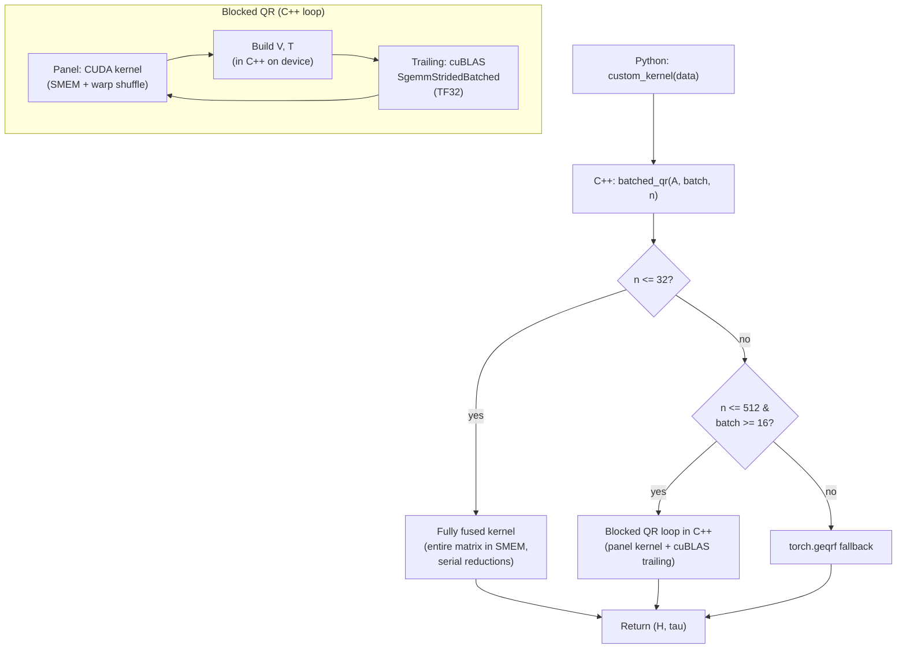
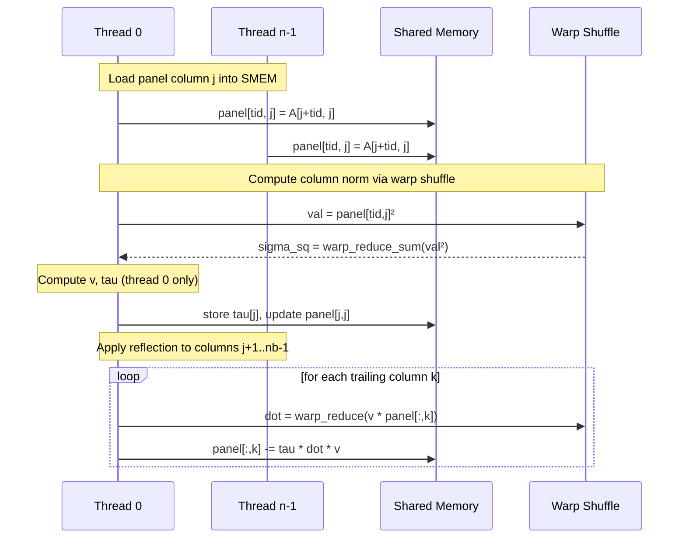

# feat: C++/CUDA QR Kernel — Eliminate Python from Hot Path

## Summary

Rewrite the QR kernel entirely in C++/CUDA via `load_inline`, moving the block loop, panel factorization, WY construction, and cuBLAS trailing update out of Python. Uses MAGMA's 3-tier dispatch strategy mapped to competition benchmark shapes. Target: break through the V5 ceiling (616ms on the critical 640×512 shape) toward sub-10ms.

---

## Problem Frame

V0-V8 experiments established that Python-level blocked Householder QR hits a ceiling at ~1.7× over baseline. The block loop runs in Python with `torch.geqrf` + `torch.bmm` calls per step, accumulating kernel launch overhead, Python dispatch cost, and temporary tensor allocation. The leaderboard #1 (704μs) is ~850× faster — they use fully compiled CUDA kernels with zero Python in the hot path.

The research identified MAGMA's 3-tier batched QR strategy as the algorithmic blueprint, with practical C++/CUDA patterns from GPU MODE competition winners for the `load_inline` submission format.

---

## Requirements

- R1. Single `submission.py` file using `load_inline` to compile C++/CUDA code
- R2. All 22 correctness tests pass (factor residual rtol=20·n·eps32, orthogonality rtol=100·n·eps32)
- R3. Sub-10ms geometric mean across all 12 benchmark shapes (10× improvement over V5)
- R4. Compilation completes within 240s test timeout on Popcorn B200
- R5. Modal A100 used for compile/test iteration; Popcorn B200 for final leaderboard

---

## Key Technical Decisions

- KTD-1. **Entire block loop in C++**: The `for j in range(0, n, nb)` loop, panel geqrf, V/T construction, and trailing GEMM dispatch all execute in compiled C++ code. Python only calls the entry function once.

- KTD-2. **Use `at::cuda::getCurrentCUDABlasHandle()`**: PyTorch's cuBLAS handle pool instead of manual `cublasCreate`. Avoids handle creation cost and stream management issues.

- KTD-3. **Shared-memory panel factorization kernel**: Panel stored in shared memory (B200 has 227KB), threads cooperate on column norms via warp-shuffle reductions (`__shfl_down_sync`), reflectors applied in-place. Block size nb=32 for the critical 512 shape.

- KTD-4. **cuBLAS `SgemmStridedBatched` for trailing update with TF32**: Three batched GEMMs per block step (V^T@trailing, T^T@W, V@W2), all dispatched from C++ with `CUBLAS_TF32_TENSOR_OP_MATH`. TF32 disabled for panel factorization (needs full FP32 for stability).

- KTD-5. **Size dispatch in C++**: Branch on `n` inside the C++ entry function. No Python conditionals in the hot path.

- KTD-6. **Pre-allocate workspace once**: V, T, W buffers allocated at the start of the C++ function, reused across all block steps. No `cudaMalloc`/`cudaFree` inside the loop.

- KTD-7. **Modal for dev iteration, Popcorn for leaderboard**: Compile and test on Modal A100 (fast iteration, ~30s round-trip). Submit to Popcorn B200 only after Modal confirms correctness and reasonable timing.

---

## High-Level Technical Design

### Panel kernel thread model

---

## Scope Boundaries

### In scope

- C++/CUDA kernel for blocked Householder QR with cuBLAS trailing update
- Size-adaptive dispatch (fused for small, blocked for medium, geqrf for large)
- Modal test harness for fast iteration
- Panel kernel with warp-shuffle reductions

### Deferred to Follow-Up Work

- Fully fused n≤32 kernel (Tier 1 MAGMA — optimization for the smallest benchmark shape)
- cuSOLVERDx integration (turnkey but availability uncertain on Popcorn)
- `torch.cuda._compile_kernel()` migration (faster compilation but experimental API)
- CuTe DSL rewrite for tensor core trailing update
- CUDA graphs for launch overhead elimination

---

## Implementation Units

### U1. Modal test harness

**Goal:** Create `modal_test.py` that uploads a submission and runs the correctness checker + timing on a Modal A100 GPU, returning results in ~30s.

**Requirements:** R5, R7

**Dependencies:** None

**Files:**
- `modal_test.py` (create)

**Approach:** Modal function that installs torch, uploads submission.py + task.py + reference.py + eval.py + utils.py, runs the correctness tests and timing benchmarks, reports results. Use `modal.Image.debian_slim().pip_install("torch")` with GPU="A100".

**Test scenarios:**
- Baseline `torch.geqrf` submission passes all tests on Modal A100
- Per-shape timings are reported
- Round-trip time from local to result is under 60s

**Verification:** Can iterate on kernels with ~30s feedback loops instead of 5-8min Popcorn queue.

---

### U2. C++ blocked QR with cuBLAS trailing update

**Goal:** Move the entire V5 blocked Householder algorithm into C++ via `load_inline`. The block loop, panel geqrf (via cuSOLVER), V extraction, T construction, and trailing GEMM (via cuBLAS) all run in compiled code.

**Requirements:** R1, R2, R4

**Dependencies:** U1

**Files:**
- `solutions/v9_cpp_blocked/submission.py` (create)

**Approach:** Single `load_inline` call compiling a C++ function `batched_qr(Tensor A) -> vector<Tensor>`. Inside:
- Allocate workspace (V, T, W buffers) once
- Loop `for j = 0; j < n; j += nb`
- Call `cusolverDnSgeqrf` for panel factorization (same as torch.geqrf but from C++)
- Extract V and build T in C++ (loops over nb, which is small)
- Call `cublasSgemmStridedBatched` × 3 for trailing update
- Use `at::cuda::getCurrentCUDABlasHandle()` for cuBLAS
- Use a cached cuSOLVER handle for panel

**Patterns to follow:** Research provided exact cuBLAS call signatures, handle management, and TF32 mode toggling patterns.

**Test scenarios:**
- All 22 correctness tests pass on Modal A100
- Geometric mean improves over V5 (616ms → target <100ms for 640×512)
- No Python in the hot path — verified by removing all torch ops except the entry call
- Compilation completes within 120s

**Verification:** Modal test shows correctness + measurable speedup over V5. Then submit to Popcorn B200.

---

### U3. Custom CUDA panel factorization kernel

**Goal:** Replace the cuSOLVER panel call with a custom CUDA kernel that's faster for batched small panels. Uses shared memory for the panel, warp-shuffle reductions for column norms.

**Requirements:** R2, R3

**Dependencies:** U2

**Files:**
- `solutions/v10_custom_panel/submission.py` (create)

**Approach:** Write a `__global__` panel kernel:
- One thread-block per batch matrix
- 256 threads cooperating on the panel (n-j rows × nb columns)
- Panel loaded into shared memory (column-major with +1 padding to avoid bank conflicts)
- Column norm via `warp_reduce_sum` using `__shfl_down_sync`
- Householder vector computed by thread 0, broadcast via shared memory
- Reflection applied to trailing panel columns by all threads cooperatively
- Results written back to global memory in compact Householder format

**Test scenarios:**
- Panel kernel produces identical (H, tau) to cuSOLVER within FP32 tolerance
- All 22 correctness tests pass including band, rowscale, nearcollinear
- Panel kernel is faster than cuSOLVER for batch=640, n=512, nb=32
- Shared memory usage fits within B200's 227KB limit

**Verification:** Modal + Popcorn both show correctness. Panel timing measured in isolation vs cuSOLVER.

---

### U4. TF32 trailing update and size-adaptive dispatch

**Goal:** Enable TF32 for the cuBLAS trailing GEMMs and implement size-adaptive dispatch in C++. Verify numerical stability across all test matrix types.

**Requirements:** R2, R3

**Dependencies:** U3

**Files:**
- `solutions/v11_adaptive_tf32/submission.py` (create)

**Approach:**
- Enable `CUBLAS_TF32_TENSOR_OP_MATH` before trailing GEMMs, restore after
- C++ dispatch: n≤512 with batch≥16 → custom blocked QR; else → `torch.geqrf`
- Test TF32 on all 22 correctness cases — if any fail (band/rowscale were borderline with TF32 in V3), fall back to FP32 for those cases or reduce nb

**Test scenarios:**
- All 22 tests pass with TF32 trailing GEMMs (the V3 band/rowscale failures were from Python-level TF32 affecting everything; C++ can scope TF32 to trailing GEMMs only)
- TF32 gives measurable speedup on trailing-GEMM-dominated shapes (n=512, 1024)
- Size dispatch in C++ eliminates Python branching overhead

**Verification:** All tests pass on Modal and Popcorn. Geometric mean competitive with top-20 leaderboard.

---

### U5. Profiling, tuning, and final submission

**Goal:** Profile per-shape bottlenecks, tune nb per shape, and submit the best configuration to the leaderboard.

**Requirements:** R3

**Dependencies:** U4

**Files:**
- `solutions/v12_final/submission.py` (create)
- `experiment_plan.md` (update — final results)

**Approach:**
- Profile each benchmark shape: what fraction is panel vs trailing GEMM vs overhead?
- Tune nb per shape (nb=16 for small panels, nb=32 for medium, nb=64 for large)
- Consider: nested blocking in the panel (factor wide panel with inner block size ib=8)
- Consider: CUDA graphs for the 640×512 shape (high batch, fixed geometry)

**Test scenarios:**
- Final submission passes all 22 tests on Popcorn B200
- Geometric mean is best achieved across all versions
- No shape regresses compared to V4/V5 (fallback to geqrf for large shapes)

**Verification:** Leaderboard position recorded. Experiment plan updated with complete results table.

---

## Risks & Dependencies

| Risk | Impact | Mitigation |
|------|--------|------------|
| `load_inline` compilation exceeds 240s test timeout | Can't submit | Use `torch.cuda._compile_kernel()` (0.01s compile) as fallback. Or reduce CUDA source size |
| cuSOLVER handle creation causes device sync | Slowdown on first call | Cache handle in static variable. Warm up during module import |
| TF32 causes correctness failures on stress tests | Test failures | Scope TF32 to trailing GEMMs only. Fall back to FP32 if needed |
| Modal A100 timings don't predict B200 behavior | Wasted optimization effort | Use Modal for correctness only. Trust Popcorn B200 for performance numbers |
| B200 compute capability (sm_100) not auto-detected by load_inline | Compilation fails or suboptimal code | Explicitly pass `-arch=sm_100a` or let PyTorch auto-detect |

---

## Sources & Research

- [MAGMA Batch QR (Abdelfattah et al. 2022)](https://www.netlib.org/utk/people/JackDongarra/PAPERS/batchqr-gpu-2022.pdf): 3-tier strategy, fused panel kernels, 16-25× over cuBLAS
- [cuSOLVERDx device-side QR](https://docs.nvidia.com/cuda/cusolverdx/examples/qr_example.html): Template-based on-device batched QR in shared memory
- [NVFP4 Grouped GEMM Worklog](https://mufeezamjad.com/blog/nvfp4-group-gemm): B200-specific kernel patterns (persistent scheduling, warp specialization)
- [MixedPrecisionBlockQR](https://github.com/jaidonlybbert/MixedPrecisionBlockQR): Open-source CUDA QR with FP16 trailing GEMM
- [torch.cuda._compile_kernel RFC](https://github.com/pytorch/pytorch/issues/163142): 1000× faster kernel compilation via NVRTC
- [GPU MODE reference-kernels load_inline example](https://github.com/gpu-mode/reference-kernels/blob/main/problems/pmpp/vectoradd_py/solutions/correct/submission_cuda_inline.py): Canonical load_inline submission structure
- V0-V8 experiment results from `experiment_plan.md`: Python-level ceiling at 1.74× (V5), TF32 correctness issues (V3), torch.compile timeout (V7)
